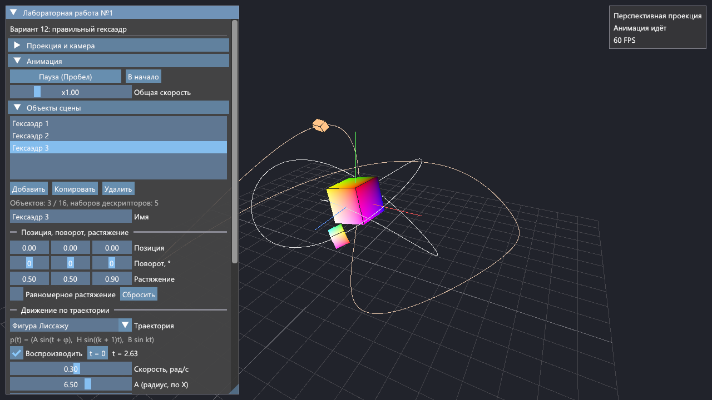
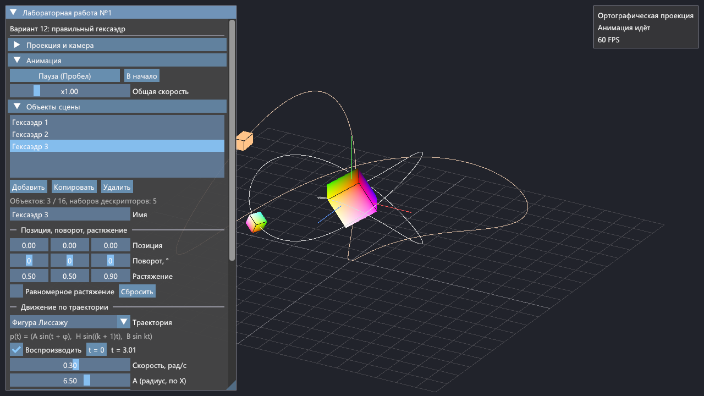

# Лабораторная работа №1. Основы 3D-графики

Выполнил: ФИО, группа

Вариант 12 — правильный гексаэдр. Сделал все дополнительные задания (1–6).

Писал на C++20 с Vulkan, GLFW и ImGui, за основу взял [стартовый код](https://github.com/vladeemerr/vulkan-starter-app) с курса.





## Задание

Цель — познакомиться с основами 3D-графики: построением простых 3D-объектов, проекцией на 2D-плоскость, матрицами перспективной и ортографической проекции и аффинными преобразованиями.

Мой вариант — правильный гексаэдр (куб, правильный многогранник {4, 3}: 8 вершин, 12 рёбер, 6 квадратных граней).

Дополнительные задания:

1. Переключение матрицы проекции (ортографическая и перспективная) в интерфейсе.
2. Элементы интерфейса для изменения позиции, поворота и растяжения фигуры.
3. Движение и поворот фигуры по сложной траектории, пауза и воспроизведение анимации, изменение скорости и параметров траектории.
4. Изменение цвета фигуры через интерфейс (ColorEdit).
5. Процедурные цвета вершин в зависимости от их позиции; цвет из интерфейса умножается на цвет вершин.
6. Несколько объектов на сцене с использованием больше одного набора дескрипторов (VkDescriptorSet).

## Что сделано

- Гексаэдр строю в коде (`hexahedron.cpp`): 8 вершин получаются из битов номера вершины (каждый бит — знак одной координаты), грани режу на треугольники и проверяю порядок обхода через векторное произведение, рёбра — пары вершин, номера которых отличаются одним битом. Получается 8 вершин и 36 индексов.
- Матрицы написал сам (`math.hpp`): перемещение, растяжение, повороты, `lookAt`, перспективная и ортографическая проекция по формулам из лекции.
- **Задание 1.** Переключатель проекции в окне «Проекция и камера» или клавиша P. Для перспективы настраивается угол обзора, для ортографии — высота объёма (по умолчанию подбирается так, чтобы размер не менялся при переключении). Текущие матрицы P и V выводятся в интерфейсе.
- **Задание 2.** У выбранного объекта можно менять позицию, поворот (углы Эйлера) и растяжение, общее или по каждой оси. Показываю итоговую матрицу модели.
- **Задание 3.** Семь траекторий: окружность, эллипс, волна вдоль окружности, фигура Лиссажу, узел-трилистник, лемниската Бернулли, роза. Настраиваются параметры A, B, H, k, φ и наклон плоскости траектории. Есть собственное вращение по трём осям и поворот фигуры по касательной к траектории. Пауза для всей сцены (кнопка или пробел) и для отдельного объекта, общая скорость и скорость каждого объекта. Траектория рисуется линией.
- **Задание 4.** «Цвет фигуры» (ColorEdit3) у каждого объекта.
- **Задание 5.** Цвет вершины считается по её координатам. Есть три схемы: RGB по (x, y, z), градиент по высоте, радуга по углу вокруг оси Y. В шейдере цвет из интерфейса умножается на цвет вершины, умножение можно выключить.
- **Задание 6.** Два набора дескрипторов: `set = 0` — общий для кадра (матрицы V и P), `set = 1` — у каждого объекта свой, со своим uniform-буфером (матрица M и цвет). Вершинный и индексный буферы у всех объектов общие, перед отрисовкой каждого объекта привязывается его `set = 1`. Объекты можно добавлять, копировать и удалять (до 16).
- Дополнительно: камера вращается мышью, рёбра фигур, сетка и оси координат.

## Сборка и запуск

Нужны Vulkan SDK (с `glslc`), CMake 3.20+, Ninja, компилятор с поддержкой C++20 (я собирал MinGW-w64 GCC 16) и git — CMake сам скачивает GLFW, vk-bootstrap, VulkanMemoryAllocator и ImGui.

Из корня проекта:

```bash
cmake --preset release
cmake --build build-release --parallel
./build-release/cg-lab1.exe
```

Для отладочной сборки вместо `release` пишется `debug`. Под Visual Studio 2022 — пресет `msvc-release`, исполняемый файл будет в `build-release/Release/`.

Шейдеры из `shaders/` компилируются в SPIR-V при сборке автоматически.

## Управление

- зажать левую или правую кнопку мыши и двигать — вращать камеру;
- колесо мыши — приблизить или отдалить;
- **P** — переключить проекцию;
- **Пробел** — пауза;
- **R** — сбросить камеру.

Всё остальное — в окне «Лабораторная работа №1»: проекция и камера, анимация, список объектов и параметры выбранного, отображение, сведения о фигуре.

## Структура

- `source/application.cpp` — сцена, наборы дескрипторов, конвейеры, анимация, интерфейс, запись команд;
- `source/graphics.cpp`, `graphics.hpp` — буферы через VMA, загрузка шейдеров, создание графического конвейера;
- `source/math.hpp` — векторы и матрицы;
- `source/hexahedron.cpp`, `hexahedron.hpp` — построение и раскраска гексаэдра;
- `shaders/scene.vert`, `shaders/scene.frag` — шейдеры;
- `source/main.cpp`, `source/graphics_internal.*` — стартовый код.

## Что поменял в стартовом коде

- При сворачивании окна программа пыталась пересоздать swapchain нулевого размера и падала с ошибками валидации. Теперь, пока окно свёрнуто, кадры пропускаются, а swapchain пересоздаётся после восстановления.
- Сообщение «Failed to present» печаталось на каждом успешном кадре — поправил условие.
- `main` теперь возвращает код ошибки.
- В `CMakeLists.txt` добавил свои файлы и шейдеры, `/utf-8` для MSVC (интерфейс на русском) и статическую линковку для MinGW.
